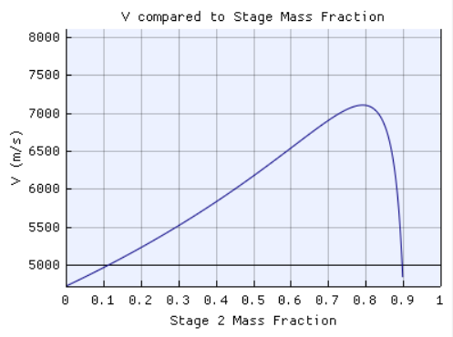

# Optomization for a three stage missile

An application for optomizing the mass ratios for a multi-stage rocket. 


## Purpose

The goal of this application is to optimize a three stage missile with a booster stage and one without, and the compare the results of these optimization to determine if the ease of laucnh provided by a booster stage is worth the loss in performance. 

This program is an interactive GUI which compares the performance of the missile with and without the booster stage. It has graphs showing the optimization process and how the values for the optimized rocket were determined.

## Method

This program uses Tsiolkovsky rocket equations. 

${\Delta}v=I_{sp}g\ln{\frac{m_0}{m_f}}$

This equation gives us the velicty contributed by each stage. By looping through different stage sizes, this program calculated the best stage sizes by maximizing total velocity for a given propellent mass and payload. 

## Variable Descriptions

### Rocket Constants

These variables are physics constants associated with rockets. 

- `ISP`: The specific impulse of each stage of the rocket. 
- `Fuel Density`: The density of the propellent used for the rocket. 
- `Structural Efficiency`: The structural efficiency (se) of the rocket. This determines the structure mass for eachs stage which is determined as $m_p / se$.

### Problem Specificiations

These variables are specific to the problem we are solving. The default values here were given by our client. 

- `Payload`: The payload the rocket is carrying. 
- `Stack Height`: The height of all three stages. 
- `Rocket Diameter`: The diameter of the rocket. 
- `Pop-out burn time`: The amount of time the pop-out booster burns for. 

### Constraints 

This section allows the user to enter constraints to stage size. This is useful since there is only a certain size that can practically be built in real life. 

- `Constrain Optimization`: A checkbox determining if the constraints are applied. 
- `Min mass fraction`: A values from 0-1 determing the smallest possible mass fraction. Not that any value above $1/3$ will obviously result in an impossible optimization. 
- `Max mass fraction`: A values from 0-1 determing the largest possible mass fraction for a stage. Not that any value below $1/3$ will obviously result in an impossible optimization. 

## Setup

Download python version 3.11.7 or equivalent version. 

Download the DearPyGUI library using the following commands. 
```
pip install dearpygui
pip install dearpygui_ext
```

Run the file `src/main.py`

## Results

### Data from Default Simulation





### Performance Metrics
