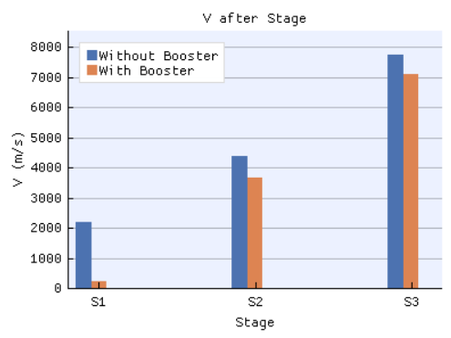

# Optomization for a three stage missile

An application for optomizing the mass ratios for a multi-stage rocket. 


## Purpose

The goal of this application is to optimize a three stage missile with a booster stage and one without, and the compare the results of these optimization to determine if the ease of laucnh provided by a booster stage is worth the loss in performance. 

This program is an interactive GUI which compares the performance of the missile with and without the booster stage. It has graphs showing the optimization process and how the values for the optimized rocket were determined.

## Method

This program uses Tsiolkovsky rocket equations. 

${\Delta}v=I_{sp}g\ln{\frac{m_0}{m_f}}$

This equation gives us the velicty contributed by each stage. By looping through different stage sizes, this program calculated the best stage sizes by maximizing total velocity for a given propellent mass and payload. 


## Setup

Download python version 3.11.7 or equivalent version. 

Download the DearPyGUI library using the following commands. 
```
pip install dearpygui
pip install dearpygui_ext
```

Run the file `src/main.py`

## Results

### Data from Default Simulation




### Performance Metrics


